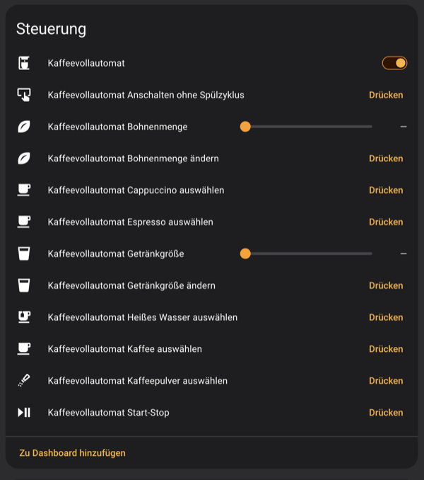

# ☕ ESPHome Philips EP2231

> Home Assistant control for a Philips Series 2200 (EP2231) coffee machine, over ESPHome.


An ESP is spliced into the ribbon cable between the machine's mainboard and its display unit, where it can read, drop and inject messages. That gives Home Assistant a power switch, the machine status, the bean/size settings, and buttons for every front-panel key.



> [!WARNING]
> Opening the machine voids the warranty, and you might break or brick it. Do this at your own risk.

## 🙏 Credit

All of this rests on [TillFleisch/ESPHome-Philips-Smart-Coffee](https://github.com/TillFleisch/ESPHome-Philips-Smart-Coffee), which reverse-engineered the bus protocol and built the man-in-the-middle approach in the first place. Thank you for figuring out the protocol — this repository would not exist without it.

## 🍴 Scope, and how this differs

This is a **hard fork**, not a downstream branch. It diverged at [`6602c04`](https://github.com/TillFleisch/ESPHome-Philips-Smart-Coffee/commit/6602c047c5be34efb0a6ec42af0bb32b5c4a3d49) (2023-02-28) and was rewritten from there; no file is shared unchanged, and nothing here is intended to go back upstream.

The scope is deliberately narrow: **one machine, one language**. It targets a Philips EP2231 (Series 2200 with a LatteGo instead of a steam wand) on a Wemos D1 Mini, and reports status in German, because that is what runs in my kitchen. If you have a different model, or want English, **use upstream** — it supports several models and four languages, and is the better starting point for anything that is not exactly this setup.

Comparison as of upstream [`d0ed704`](https://github.com/TillFleisch/ESPHome-Philips-Smart-Coffee/commit/d0ed704) (2026-02-15):

|                     | This fork                                                                            | Upstream                                                            |
| ------------------- | ------------------------------------------------------------------------------------ | ------------------------------------------------------------------- |
| Models              | EP2231 only, hardcoded                                                               | EP2220, EP2235, EP3243, EP3246 via `model:`                         |
| Language            | German only, hardcoded                                                               | `language:` — en-US, de-DE, it-IT, hu-HU                            |
| Status sensors      | Overall status **plus 11 individual LED sensors** (`for: led_beans`, `led_error`, …) | One overall status sensor                                           |
| Buttons             | 9 actions, `long_press` for secondary functions                                      | `SELECT_*`/`MAKE_*` pairs for 7 drinks, milk, play/pause            |
| Bean & size numbers | `beans` and `size`, platform is optional                                             | `beans`, `size`, `milk`, with a per-drink `source:`                 |
| Tuning options      | None — sensible values are compiled in                                               | `invert_power_pin`, `power_trip_delay`, `power_message_repetitions` |
| Checksum            | Understood well enough to compute any message, see [`protocol.md`](protocol.md)      | Unknown                                                             |

Three behavioural differences worth knowing:

- **The bridge never stalls.** The display power trip and the long-press injection complete from `loop()` instead of blocking it, so mainboard frames are not dropped while either is in progress.
- **Power state follows the mainboard**, not the display. The mainboard only ever answers display polls, so its traffic is the more direct signal that the machine is awake.
- **Incoming frames are still validated by repetition**, not by the checksum: the mainboard repeats every frame, so a frame whose trailing bytes differ from the previous one was garbled in transit and is dropped. Same approach as upstream.

Beyond the protocol notes, the EP2231 command set and the checksum findings in [`protocol.md`](protocol.md) are this fork's own work.

## 🚀 Quickstart

Add the component and wire up the two UARTs. A complete, working configuration is in [`example.yaml`](example.yaml); the short version:

```yaml
external_components:
  - source: github://thiesgerken/esphome-philips-ep2231@main

# The display UART occupies the pins the logger would use
logger:
  baud_rate: 0

uart:
  - id: uart_mainboard
    tx_pin: GPIO1
    rx_pin: GPIO3
    baud_rate: 115200
  - id: uart_display
    tx_pin: GPIO15
    rx_pin: GPIO13
    baud_rate: 115200

philips_series_2200:
  id: philip
  display_uart: uart_display
  mainboard_uart: uart_mainboard
  power_pin: GPIO12

switch:
  - platform: philips_series_2200
    controller_id: philip
    name: "Power"
    icon: mdi:coffee-maker

text_sensor:
  - platform: philips_series_2200
    controller_id: philip
    for: overall
    name: "Status"

button:
  - platform: philips_series_2200
    controller_id: philip
    action: coffee
    name: "Kaffee"
```

## ⚙️ Configuration

### `philips_series_2200`

The hub component. Everything else refers back to it via `controller_id`.

- **id** (**Required**, string): controller ID used by the entity configurations.
- **display_uart** (**Required**, string): ID of the UART component connected to the display unit.
- **mainboard_uart** (**Required**, string): ID of the UART component connected to the mainboard.
- **power_pin** (**Required**, [Pin](https://esphome.io/guides/configuration-types.html#config-pin)): pin driving the MOSFET/transistor that cuts display power.

### Power switch (`switch`)

Turning it on injects a power-on command and then reboots the display, which otherwise does not notice that the machine woke up. That reboot is retried until the display is back on the bus, or five attempts have failed.

- **controller_id** (**Required**, string)
- **clean** (**Optional**, boolean): run a cleaning cycle during startup. Defaults to `true`.
- All other options from [Switch](https://esphome.io/components/switch/index.html#config-switch).

### Action buttons (`button`)

- **controller_id** (**Required**, string)
- **action** (**Required**, string): one of `coffee`, `espresso`, `hot_water`, `cappuccino`, `beans`, `size`, `aqua_clean`, `calc_clean`, `start_stop`.
- **long_press** (**Optional**, boolean): hold the button instead of tapping it, which is how the machine reaches its secondary functions — `beans` with `long_press` switches to pre-ground coffee. Defaults to `false`.
- All other options from [Button](https://esphome.io/components/button/index.html#config-button).

### Status sensors (`text_sensor`)

- **controller_id** (**Required**, string)
- **for** (**Required**, string): what this sensor reports.
  - `overall` — a single summarising state: `Aus`, `Bereit`, `Vorbereitung`, `Spült`, `Zubereitung (…)`, `<Getränk> ausgewählt (Größe & Stärke)`, `Wasser leer`, `Trester voll`, `Fehler`, `Unbekannt`.
  - `led_espresso`, `led_coffee`, `led_cappuccino`, `led_hot_water` — `Aus`, `Gedimmt`, `An`, `Zwei Getränke`.
  - `led_beans`, `led_size` — `Aus`, `Stufe 1`, `Stufe 2`, `Stufe 3`.
  - `led_powder`, `led_water_empty`, `led_waste_full`, `led_error` — `An` or `Aus`.
  - `led_start_stop` — `An`, `Aus` or `Blinkt`.
- All other options from [Text Sensor](https://esphome.io/components/text_sensor/index.html#config-text-sensor).

The individual LED sensors are the raw truth from the panel; `overall` is an interpretation layered on top and is what the automations below use.

### Bean amount & cup size (`number`)

Reports and sets the bean amount or cup size of whichever beverage is selected right now. The value ranges from `1` to `3` and is unavailable while the corresponding LED is dark, i.e. outside the selection screen. Writing a value presses the button until the machine has cycled to that level.

- **controller_id** (**Required**, string)
- **type** (**Required**, string): `beans` or `size`.
- All other options from [Number](https://esphome.io/components/number/index.html#config-number).

This platform is optional — leave it out of the configuration and it is not compiled in.

## 🤖 Fully automated coffee

The script below brews a cup unattended. The power switch it uses does not clean during startup; the cleaning check is still needed because the machine always cleans after a power loss. It only proceeds when there was no cleaning cycle and a mug is present.

```yaml
script:
  - id: coffee_script
    then:
      - if:
          condition:
            lambda: 'return id(status).state == "Aus";'
          then:
            - switch.turn_on: power
            - wait_until:
                condition:
                  lambda: 'return (id(status).state == "Bereit") || (id(status).state == "Spült");'
                timeout: 120s
            - if:
                condition:
                  lambda: 'return (id(status).state == "Bereit") && id(mug_sensor).state;'
                then:
                  - delay: 5s
                  - button.press: make_coffee_button
          else:
            if:
              condition:
                lambda: 'return (id(status).state == "Bereit") && id(mug_sensor).state;'
              then:
                - button.press: make_coffee_button
```

## 🔌 Wiring

The display unit is connected to the mainboard by an 8-pin ribbon cable with Picoflex connectors. The display is powered by the mainboard, and the two communicate over a serial bus. The ESP sits in the middle of that bus: the RX/TX lines are piped through it so messages can be read, intercepted and injected.

Injecting a "turn on" command wakes the machine but not the display, so the display is rebooted by briefly removing its power through a transistor or MOSFET — that is what `power_pin` drives.

**Unlabeled wires should be connected straight through.**


| Pin | Mainboard | Function                           |
| --- | --------- | ---------------------------------- |
| 0   | 5V        | 5V                                 |
| 1   | GND       | GND                                |
| 2   | GND       | GND                                |
| 3   | unused    | unused                             |
| 4   | TX/RX     | Messages from mainboard to display |
| 5   | RX/TX     | Messages from display to mainboard |
| 6   | 0V        | unknown — very noisy               |
| 7   | 5V        |                                    |

### Voltage regulation

The Wemos D1 Mini has a built-in voltage regulator, so the 5V from the mainboard is fine. A different board must be 5V tolerant or get its own regulator — otherwise you release the magic smoke.

## 📡 Communication protocol

The bus protocol, the EP2231 command set, the machine identification bytes and what is known about the checksum are documented in [`protocol.md`](protocol.md).

## 🧯 Troubleshooting

- Check the wiring first.
- ESPHome's UART debug function shows the traffic in both directions and confirms the wiring is right.
- Commands differ between models and revisions. If nothing responds, the command set is likely wrong for your machine — see [`protocol.md`](protocol.md) and the related work below.

## Related work

- [TillFleisch/ESPHome-Philips-Smart-Coffee](https://github.com/TillFleisch/ESPHome-Philips-Smart-Coffee) — the original, and the right choice for any model other than an EP2231.
- [SmartPhilips2200](https://github.com/chris7topher/SmartPhilips2200) by [@chris7topher](https://github.com/chris7topher) — uses different commands, likely a different model revision.
